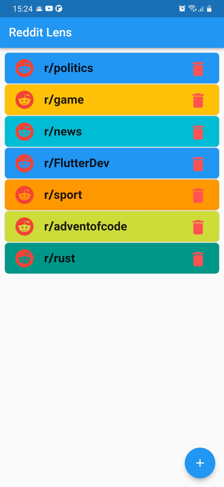

## Reddit Lens

Reddit Lens is a ML based proof of concept project for detecting trolls and bots on subreddits. It consists in a Flutter Mobile Consumer, a Flask API for exposing the ML model and a Kafka Cluster for streaming data.

Overview Page                       |Dashboard Page
:----------------------------------:|:----------------------------------:
|
